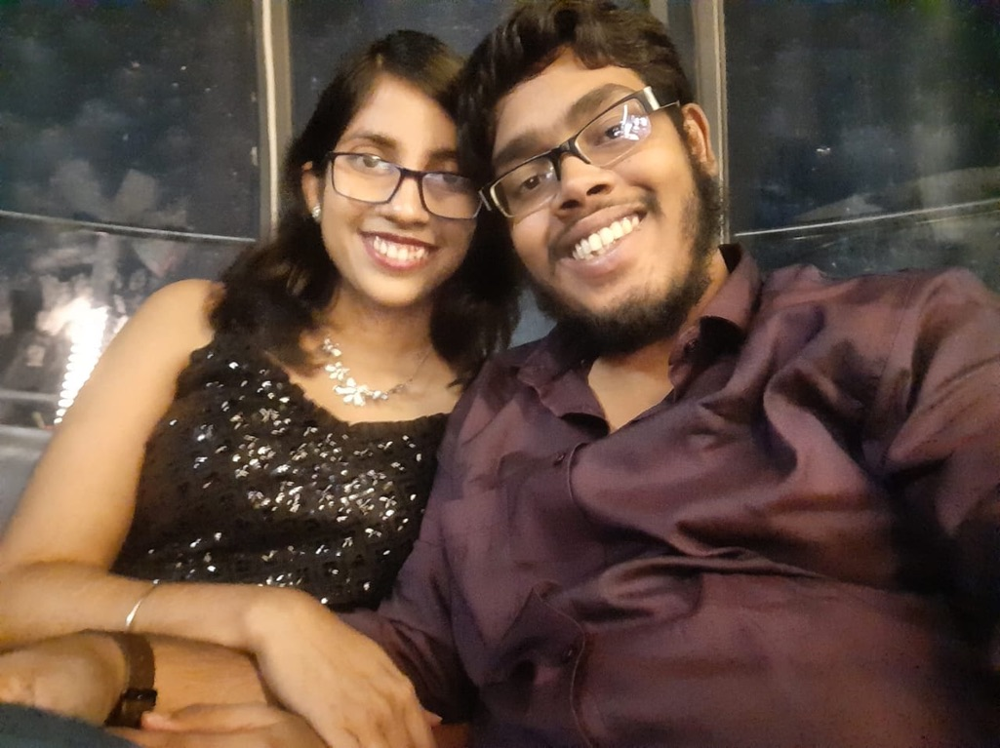

## Hello! Katha Haldar and Sarthak Das here.

Best friends, lovers, collaborators, dreamers with quite a lot to share.

## Who are we

1. **Katha Haldar.** Completed her Integrated Bachelors-Masters Degree in Physics from IACS Kolkata. Presently pursuing her Ph.D from Indiana University, Indianapolis. Katha’s principal areas of interest include drawing, photography, creative writing and music. Her artwork has been nominated as a finalist in Hashtag Kalakar’s Global Arts And Painting Competition 2021 in the Oil Painting category. Her photographs have been featured in COG India’s India Photo Fest 2022 held at the Indian Council for Cultural Relations, Kolkata and in Luna Art’s Reminiscence: International Photography Exhibition 2023 held at the All India Fine Arts and Crafts Society, New Delhi. Katha is also a translator and illustrator for People’s Archive of Rural India. You can find her instagram account [here](https://instagram.com/_.joker_in_the_pack._) and her personal blog [here](https://katha-r-katha.blogspot.com/).

2. **Sarthak Das.** Completed his Integrated Bachelors-Masters in Computer Science from IACS Kolkata. Presently pursuing his Ph.D from IACS, Kolkata. Sarthak reads, writes and watches films as an expression of self. His short stories have been featured in Outlook India’s online magazine and the 81 Words Flash Fiction Anthology by Victorina Press, which won the 2022 Saboteur Award for Best Anthology. He has also contributed one-shot comics in collaboration with artist Boris Pecikozić to the Tales From The Dispatch anthology series from SnowyWorks and Indie Comix Dispatch. You can find his instagram account [here](https://instagram.com/the.absurdist.98) and her personal blog [here](https://dassarthak18.wordpress.com/).
